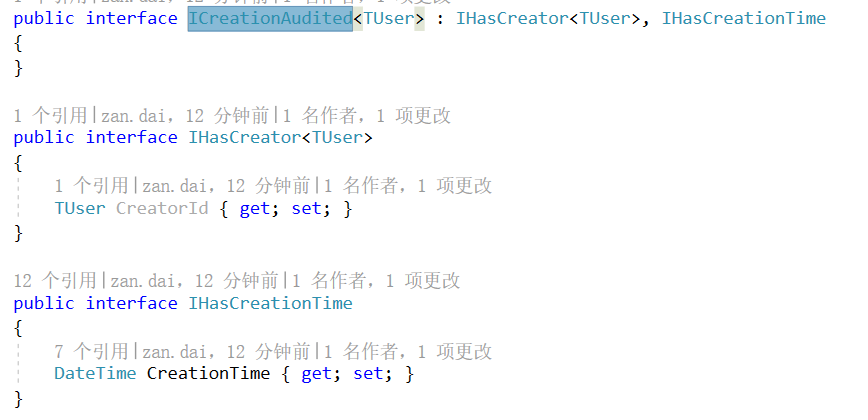
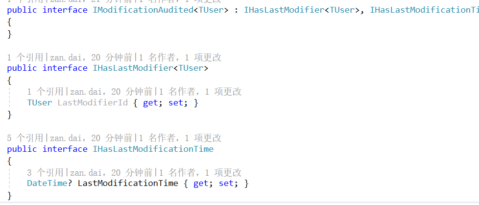
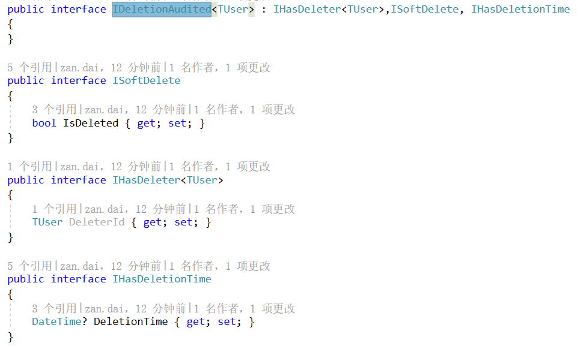
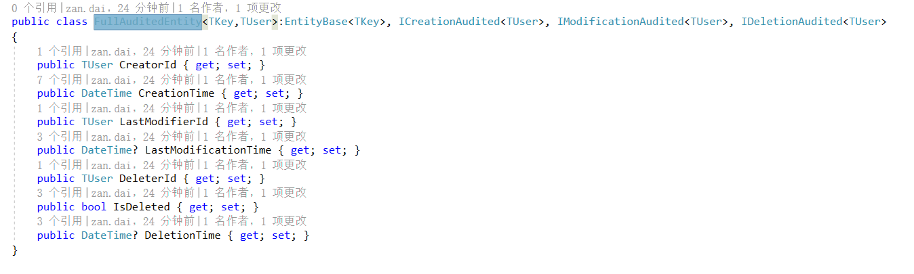

 
    
    
    
    

# Lu Ban Of .Net - .NET 鲁班工匠辅助库
.Net 高可用、高效率的扩展库，希望对 .NET 开发者及爱好者带来便捷，告别996，远离ICU！！！

# Nuget

| **名称** |      **Nuget**      |
|----------|:-------------:|
| **LBON.Consts** | **** |
| **LBON.Extensions** | **** |
| **LBON.Helper** | **** |
| **LBON.DependencyInjection** | **** |
| **LBON.EntityFrameworkCore** | **** |

# 功能模块
## EntityFrameworkCore
此项目为EntityFramework 底层实现和扩展类，包括创建审计字段、修改审计字段、删除审计字段和扩展字段的封装

## Extensions
- ### [CollectionExtensions](Readmes/Extensions/COLLECTIONEXTENSIONS_README.md)
- ### [ComparableExtensions](Readmes/Extensions/COMPARABLEEXTENSIONS_README.md)
- ### [DataTableExtensions](Readmes/Extensions/DATATABLEEXTENSIONS_README.md)
- ### [DateTimeExtensions](Readmes/Extensions/DATETIMEEXTENSIONS_README.md)
- ### [DayOfWeekExtensions](Readmes/Extensions/DAYOFWEEKEXTENSIONS_README.md)
- ### [DecimalOrIntExtensions](Readmes/Extensions/DECIMALORINTEXTENSIONS_README.md)
- ### [DictionaryExtensions](Readmes/Extensions/DICTIONARYEXTENSIONS_README.md)
- ### [EnumerableExtensions](Readmes/Extensions/ENUMERABLEEXTENSIONS_README.md)
- ### [EnumExtensions](Readmes/Extensions/ENUMEXTENSIONS_README.md)
- ### [EventHandlerExtensions](Readmes/Extensions/EVENTHANDLEREXTENSIONS_README.md)
- ### [ExceptionExtensions](Readmes/Extensions/EXCEPTIONEXTENSIONS_README.md)
- ### [HttpResponseExtensions](Readmes/Extensions/HTTPRESPONSEEXTENSIONS_README.md)
- ### [ImageExtensions](Readmes/Extensions/IMAGEEXTENSIONS_README.md)
- ### [ListExtensions](Readmes/Extensions/LISTEXTENSIONS_README.md)
- ### [LockExtensions](Readmes/Extensions/LOCKEXTENSIONS_README.md)
- ### [ObjectExtensions](Readmes/Extensions/OBJECTEXTENSIONS_README.md)
- ### [StreamExtensions](Readmes/Extensions/STREAMEXTENSIONS_README.md)
- ### [StringExtensions](Readmes/Extensions/STRINGEXTENSIONS_README.md)
- ### [XmlExtensions](Readmes/Extensions/XMLEXTENSIONS_README.md)
## Helper
- ### [DirectoryHelper](Readmes/Helper/DIRECTORYHELPER_README.md)
- ### [FileHelper](Readmes/Helper/FILEHELPER_README.md)
- ### [RandomHelper](Readmes/Helper/RANDOMHELPER_README.md)
- ### [Utf8Helper](Readmes/Helper/UTF8HELPER_README.md)
## Consts
- ### [MediaType](LBON.Consts/MediaTypeConst.cs)
- ### [Regex](LBON.Consts/RegexConst.cs)

    
